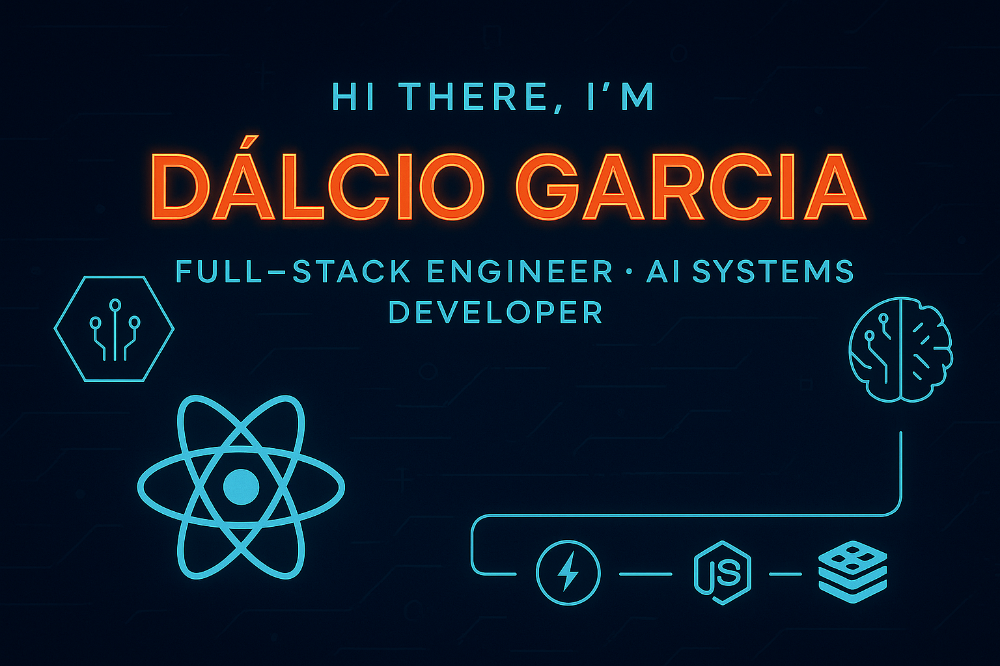

# 🌊✨ Welcome to My Digital Playground ✨🌊

<!-- Cover -->

  

  
### 👋 Hey there!  
I'm <a href="https://dalciogarcia.vercel.app/"><b><i>Dálcio Garcia</i></b></a> —  
Crafting interfaces, building experiences, and turning ideas into pixel-perfect reality 😎🚀

💡 *Frontend Developer · Web Engineer · Creative Technologist*

 

---

## 🎨 About Me

🧠 I love designing delightful interactive experiences  
🧩 Curious problem-solver  
⚡ Pixel perfection addict  
✍️ I write about tech & product design  
☕ Fuel: Coffee + Music + Late-night coding sessions

 

---

## 🧰 Tech Arsenal & Toolbox

  
  
  
  
  
  
  
  
  
  
  

 

---

## 📈 GitHub Analytics

  

 

---

## 🐍 Contribution Snake Animation

  

 

---

## 🌍 Find Me Online

  
  
  

 

---

## 🚀 Fun Facts

✅ Started coding because creating something out of nothing feels like magic  
🎮 Gamer brain = creative developer brain  
🧩 Forever obsessed with solving UX puzzles  
🌙 Night owl coding mode > everything

 

---

### ✨ Thanks for stopping by!
Stars are appreciated ⭐  
Let’s build something great together.

#

> _"Code is art, experience is emotion — and I love designing both."_

